-ENTREGA NUMERO 1

Instalar: 
-Clonar el repositorio de github 
-Ejecutar "npm install" para instalar dependencias
-Iniciar con "npm start" o "npm run dev"

---Instrucciones:

Products: 

    -POST:  agregar un producto con title, stock, price, category y thumbnails (aca se agrega una url con la imagen del producto)
    -PUT:  copiar el id del producto,  pegarlo en api/products/:pid y actualizar la propiedad (elegir opcion raw y JSON)
    -GET:  muestra todos los productos
    -GET/pid: copiar id del producto  , pegarlo en api/products/:pid para ver el producto sleccionado
    -DELETE: copiar id del producto , pegarlo en api/products/:pid para eliminar el producto

Users: 

    -POST: (en raw y JSON) declarar el usuario nuevo con name, email, password y age (tiene que ser mayor de 18)
    -PUT:  copiar el id del user,  pegarlo en api/users/:uid y actualizar la propiedad (elegir opcion raw y JSON)
    -GET:  muestra todos los users
    -GET/uid: copiar id del user  , pegarlo en api/users/:uid para ver el user sleccionado
    -DELETE: copiar id del user , pegarlo en api/users/:uid para eliminar el user

Carts:     

    -POST: en /api/carts/:uid/products/:pid colocar los respectivos id's , primero el id del usuario y luego el id del producto.
           Ademas de agregar el id del usuario y el id del producto , crea un id para el carrito. Luego en la parte raw (con JSON),
           poner "quantity" para seleccionar cuanta cantidad del producto seleccionado
    -GET: muestra todos los carritos
    -GET/cid: copiar id del cart  , pegarlo en api/carts/:cid para ver el carrito seleccionado
    -DELETE:  copiar id del cart  , pegarlo en api/carts/:cid para eliminar el carrito seleccionado

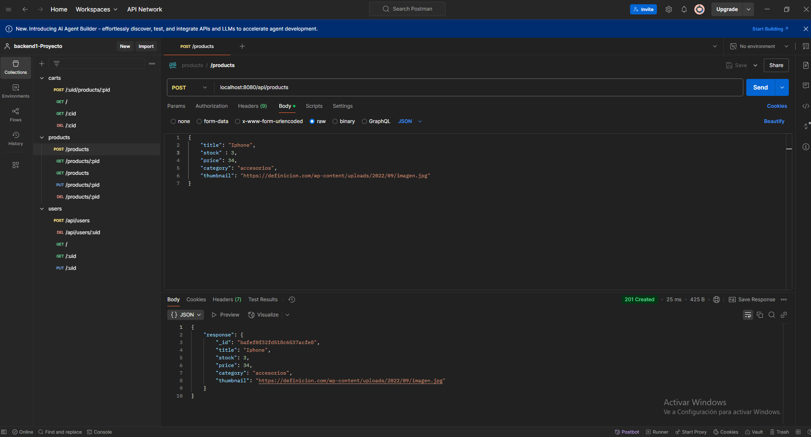
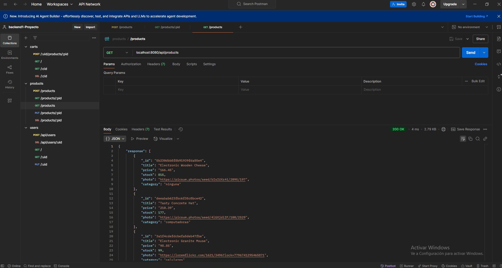
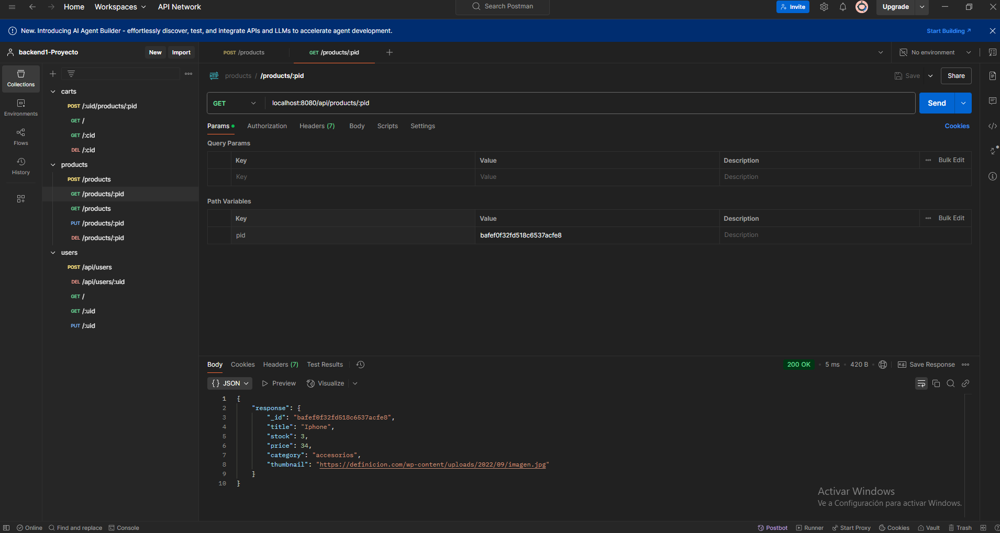
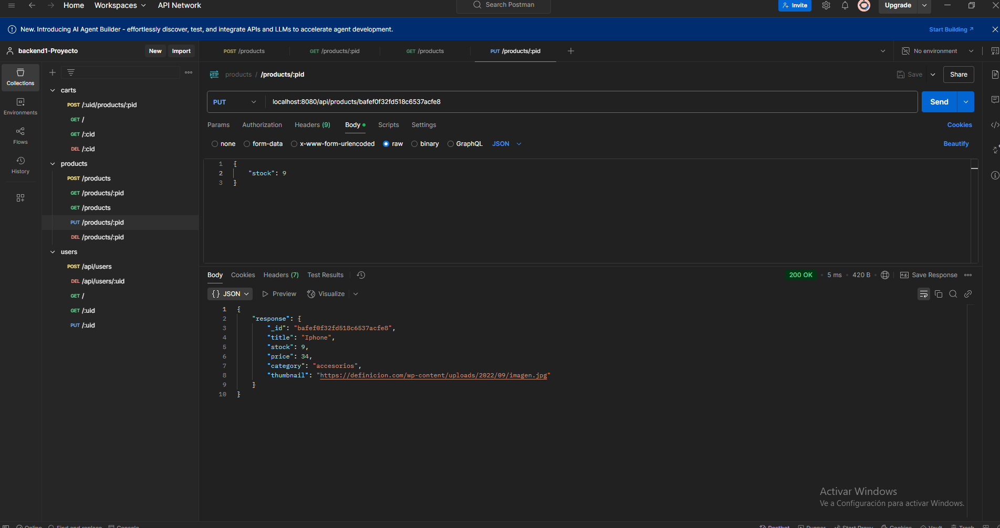

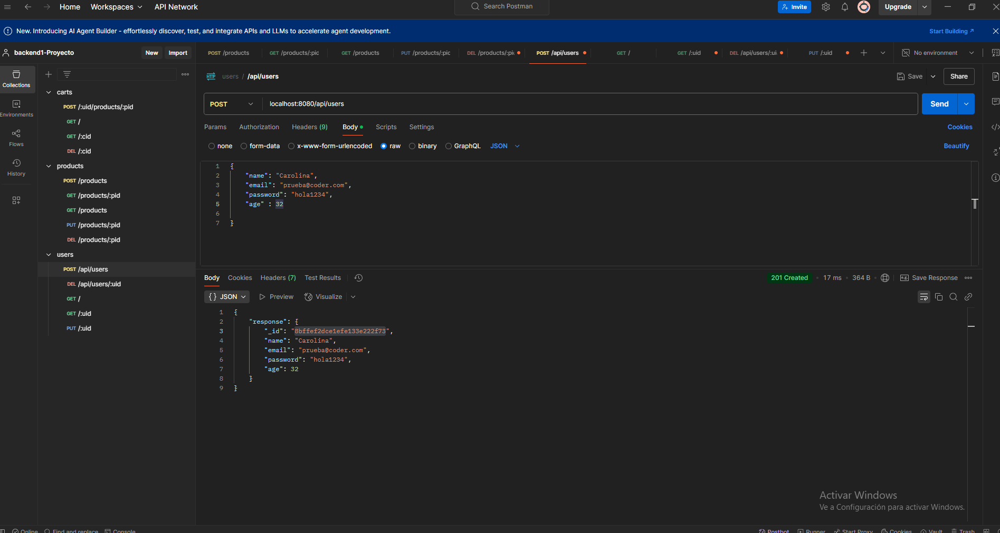
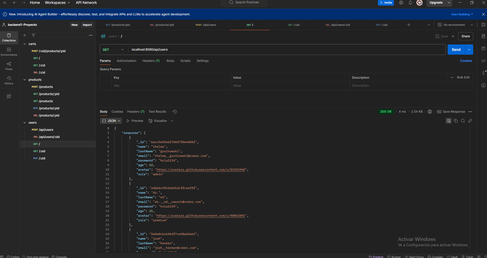
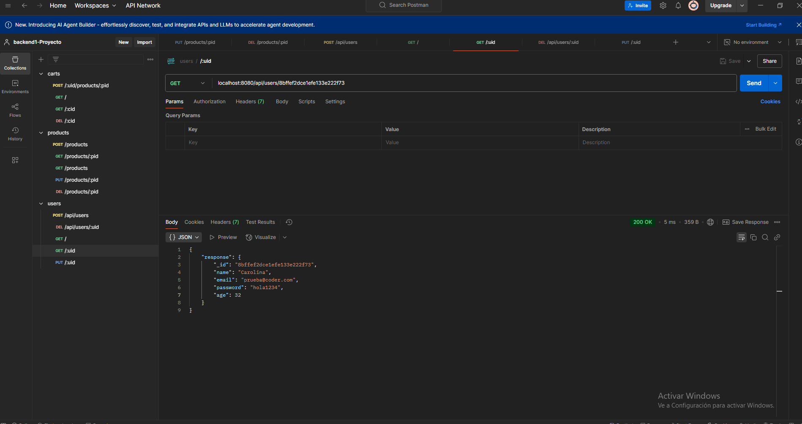
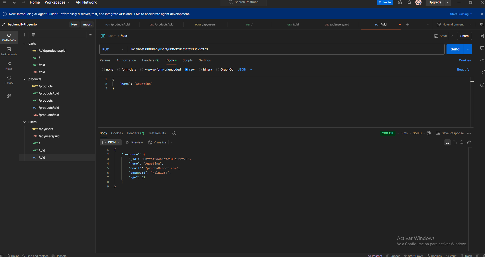
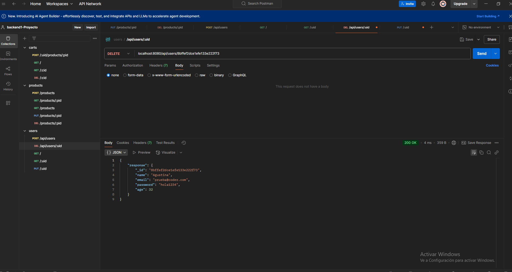
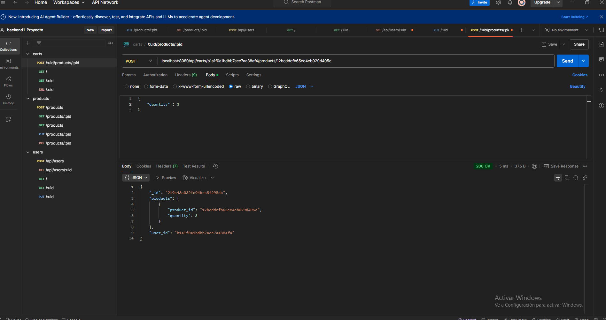
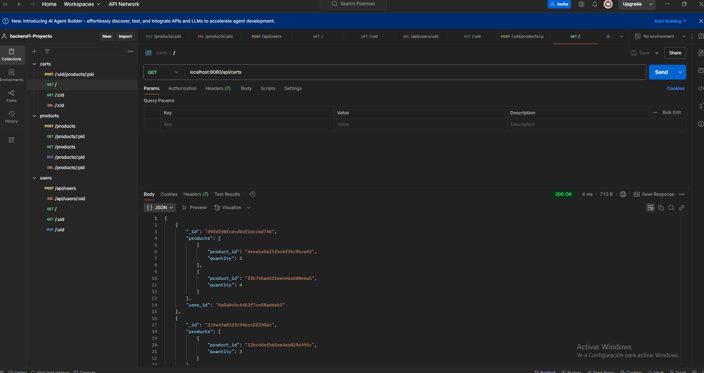
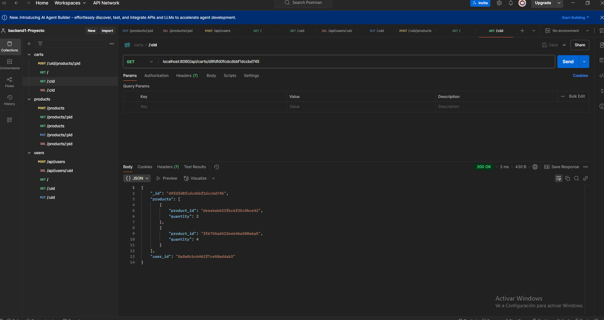
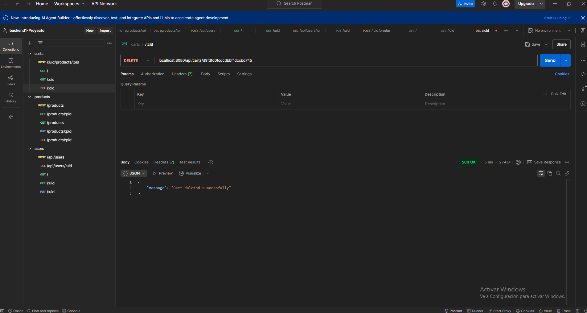

