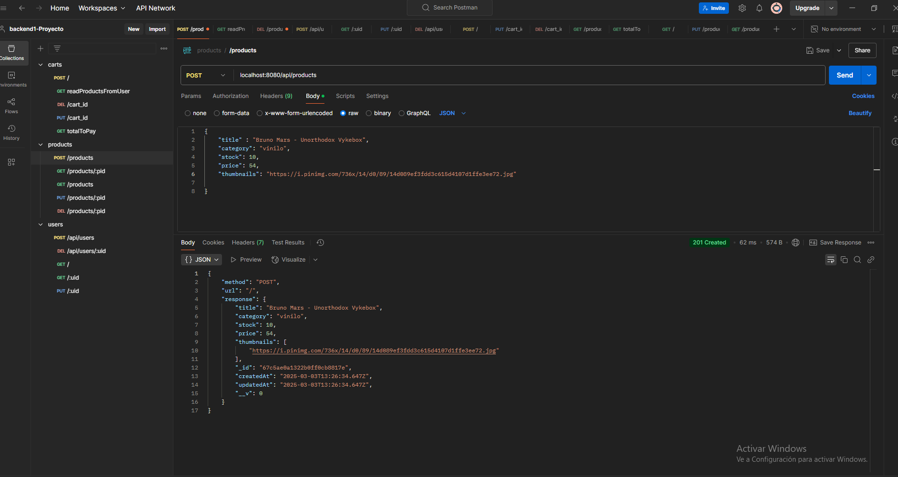

# Proyecto Final Backend 1 

## E-commerce Rolling Store

### Introduccion

- Es un e-commerce de venta de vinilo y cd, con un frontend realizado con handlebars y un backend
  realizado con express, mongo , mongoose (tambien cuenta con morgan).

- La vista es del lado del admin , cuenta con las funciones:
    - Registrar un producto
    - Ver el detalle del producto
    - Agregar producto al carrito
    - Eliminar producto del carrito
    - Eliminar todos los productos del carrito
    - Finalizar la compra.

### Registrar un producto

- Se realiza la creacion de un producto y se actualiza en tiempo real, colocar los siguientes datos:
   - nombre
   - stock
   - precio
   - category: vinilo o cd (son los validos)
   - thumbnails: copiar url de imagen del producto, si no hay se agrega una por defecto
   - Al agregarse se vera actualizado tanto en la lista de los productos a la derecha y en la seccion principal

### A tener en cuenta

- Cuando se finaliza la compra, los productos pasan de estar en reservado a pagado 
  y se mantienen en el base de datos los productos pagado para tener un historial
  de las compras realizadas por el usuario

- El login es demostrativo , es solo para que se entienda que se esta trabajando 
  del lado del administrador (se uso un solo usuario de la base de datos)

### Instalar  

Instalar: 
- Clonar el repositorio de github 
- Ejecutar "npm install" para instalar dependencias
- Iniciar con "npm start" o "npm run dev"

### Rutas de api

Products: 

    -POST:  agregar un producto con title, stock, price, category y thumbnails (en thumbnails se agrega una url con la imagen del producto)
    -PUT:  copiar el id del producto,  pegarlo en api/products/:pid y actualizar la propiedad (elegir opcion raw y JSON)
    -GET:  muestra todos los productos
    -GET/pid: copiar id del producto  , pegarlo en api/products/:pid para ver el producto sleccionado
    -DELETE: copiar id del producto , pegarlo en api/products/:pid para eliminar el producto

Users: 

    -POST: (en raw y JSON) declarar el usuario nuevo con name, email, password y date (tiene que ser mayor de 18)
    -PUT:  copiar el id del user,  pegarlo en api/users/:uid y actualizar la propiedad (elegir opcion raw y JSON)
    -GET:  muestra todos los users
    -GET/uid: copiar id del user  , pegarlo en api/users/:uid para ver el user sleccionado
    -DELETE: copiar id del user , pegarlo en api/users/:uid para eliminar el user

Carts:     

    -POST: en /api/carts declarar el user_id , product_id y quantity para agregar un producto al carrito (elegir opcion raw y JSON)
    -GET: en /api/carts/users/:uid : se pega el user_id para ver todos los productos del carrito del usuario (en ellos se encuentran los pagados y los que estan reservados)
    -GET: en /api/carts/total/:uid : se pega el user_id y se ve el total a pagar y detalles del subtotal , nombre y cantidad de productos
    -PUT: en /api/carts/:cid : con el cart_id se actualiza la propiedad deseada del producto en el carrito
    -DELETE: en /api/carts/:cid : pegar id del carrito para eliminar producto del carrito

 
 

